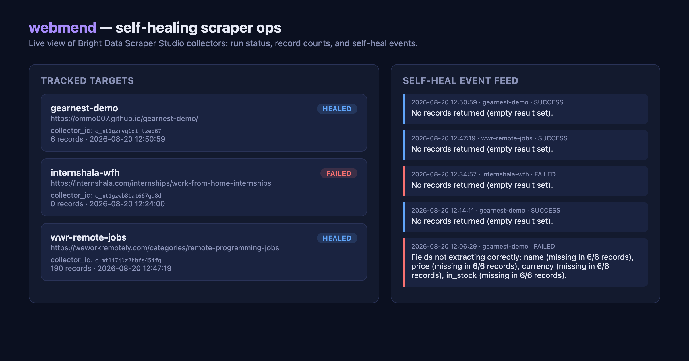

# webmend

**Self-healing web scraper ops, built on [Bright Data Scraper Studio](https://brightdata.com).**

> You write a scraper, it works, and a week later the site changes its layout
> and everything breaks quietly.

`webmend` is a terminal-first ops tool that closes that loop automatically.
For every tracked target it:

1. Runs the target's Bright Data scraper (`bdata scraper run`) via its **Collector ID**.
2. Validates the result against the fields the scraper is supposed to extract.
3. If a field went missing or empty — the site's layout drifted — it writes a
   diagnosis of exactly what broke and hands it to **`bdata scraper heal`**
   (`--auto-approve --auto-save`), then re-runs to verify the fix worked.
4. Logs the run and the heal event to SQLite, which powers a terminal
   dashboard and a small web dashboard/API — both read-only downstream
   consumers of the same Collector ID data.

Built for the ["Into the Scrape-Verse"](https://www.wemakedevs.org/hackathons/scrape-verse)
hackathon (Web-Slinger track — Best Use of Bright Data).



## Why this design

Scraper Studio's self-heal isn't "automatic repair on failure" — `bdata scraper
heal <collector_id> <prompt>` takes a natural-language description of what's
broken. The interesting engineering problem isn't calling the CLI, it's
**deciding when to call it and what to tell it**: `webmend` diffs the expected
schema against what actually came back and turns that diff into the heal
prompt itself, so the whole loop runs unattended.

## Architecture

```
bright data scraper (create/run/heal)
        |
   webmend CLI  ──────────────►  SQLite (targets, runs, heal_events)
   (terminal, primary interface)         |
                                          ├── webmend status   (terminal dashboard)
                                          └── webmend serve    (API + web dashboard)
```

- `src/bdata.js` — thin wrapper shelling out to the local `@brightdata/cli` binary with `--json`.
- `src/db.js` — SQLite schema + queries (better-sqlite3).
- `src/watchdog.js` — the validate → diagnose → heal → re-verify loop.
- `src/cli.js` — the CLI itself (`add`, `run`, `run-all`, `watch`, `status`, `heals`, `history`).
- `src/server.js` + `public/index.html` — read-only API/dashboard, a downstream consumer of the Collector ID data.
- `demo-site/` — a small storefront we own and deploy to GitHub Pages
  (https://ommo007.github.io/gearnest-demo/), with two layouts (`v1`, `v2`)
  so we can break the page's markup on demand and show the heal loop live.

## Setup

```bash
npm install
npx brightdata login          # or: brightdata login --api-key <key>
```

Apply the hackathon promo code `wemakedevs` (lowercase) on your Bright Data
account first for the $50 credit tier.

## Usage

```bash
# Track a new target — this calls `bdata scraper create` (5-10 min AI build)
webmend add <name> <url> "<what to extract>" --fields field1,field2,...

# Run one target: validate output, auto-heal + verify if it drifted
webmend run <name>

# Run every tracked target
webmend run-all

# Scheduler: run every target on a fixed interval (downstream integration #3)
webmend watch --interval 300

# Terminal dashboard
webmend status

# Heal / run history for one target
webmend heals <name>
webmend history <name>

# API + web dashboard (downstream integration #4)
npm run serve   # http://localhost:4173
```

## Live self-heal demo

The demo storefront (`demo-site/`) ships two layouts. Swapping between them
triggers a real self-heal, verified end to end — and it's **repeatable in
either direction**, not a one-off:

```bash
cd demo-site
./deploy.sh v2   # redesign: renamed classes, price split into amount/cents/currency spans,
                  # "in stock" moved from visible text to a data-availability attribute
cd ..
webmend run gearnest-demo   # fails validation -> auto-heals -> re-verifies -> 6/6 records correct
```

This was run for real during development, in both directions, on the same
Collector ID (`c_mt1gzrvq1qijtzeo67`):

| Deploy | Result |
|---|---|
| `v2` (redesign) | scraper returned 0 records → `webmend` diagnosed it → healed → **6/6 records verified correct** |
| `v1` (revert) | now-v2-tuned scraper broke again on the old layout → healed back → **6/6 records verified correct** |

Run `webmend heals gearnest-demo` to see the full, real heal-event log.

## Real-world targets

Two targets outside the demo site, neither in Bright Data's 800+ pre-built
scraper catalog:

- **`wwr-remote-jobs`** — [We Work Remotely](https://weworkremotely.com/categories/remote-programming-jobs)'s
  programming job board. On its very first real run the fresh scraper came back
  empty; `webmend` diagnosed it, called `bdata scraper heal`, re-verified, and
  landed **190 real job listings** — an unstaged self-heal on a live,
  uncontrolled site.
- **`internshala-wfh`** — [Internshala](https://internshala.com/internships/work-from-home-internships)'s
  work-from-home internship listings. This one didn't cooperate: the run came
  back empty and Bright Data's own heal attempt failed server-side too. We
  left it tracked rather than deleting it — `webmend heals internshala-wfh`
  shows the failure plainly. A tool that only ever reports success on a target
  it doesn't fully control isn't reliable, it's just quiet about the cases
  that don't work.

## Rules compliance

- Only publicly available data (no login-walled or paywalled pages).
- `.env` / API tokens are never committed — Bright Data auth lives in the CLI's
  own config store outside this repo (see `.gitignore`).
- Primary interface is the terminal (`webmend` CLI); the API/dashboard is an
  explicitly optional downstream consumer of the same data.
